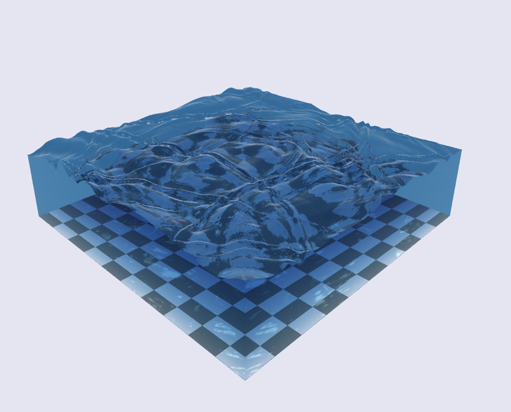

# Real-time Shallow Water

## Overview
This is an interactive demo of shallow water (simplified as a 2D wave system) implemented in WebGPU. This project was originally implemented in WebGL back in 2017, and has since been ported and improved using WebGPU. Similar to the original project, this project features solving the wave equations, this time using compute shaders, and a multi-pass render pipeline feature ray marching, and light-traced caustics.

[Click Here](https://www.wuwayne.com/webgpu-shallow-water/) to try it out.

Here's the 2017 WebGL version for comparison:

You can see the original project [here](https://github.com/wayne-wu-zz/shallow-water)

Originally developed by [Wayne Wu](https://github.com/wayne-wu) and [Kyle Fung](https://github.com/KyleFung)
